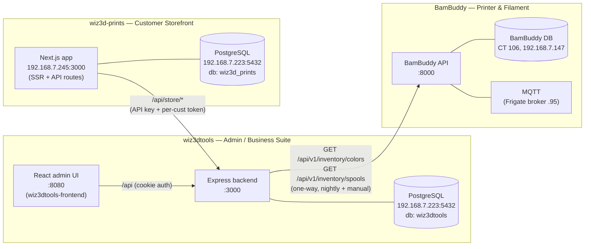
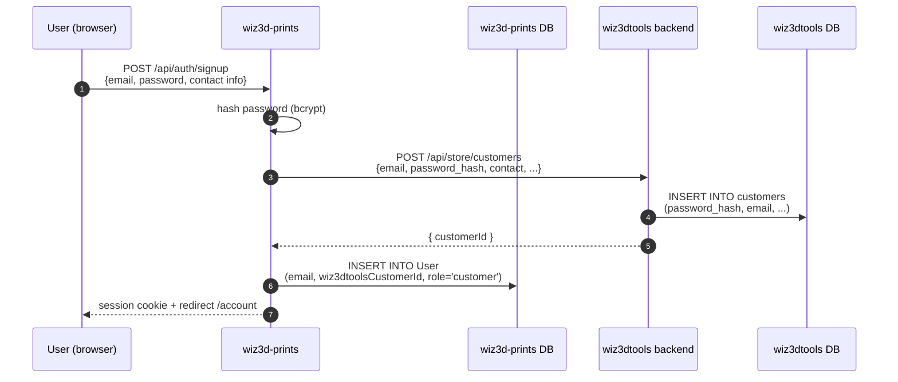
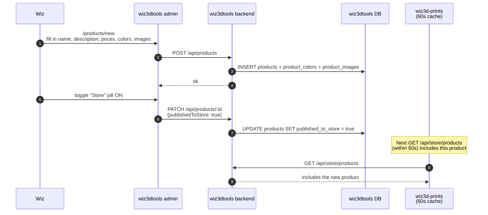
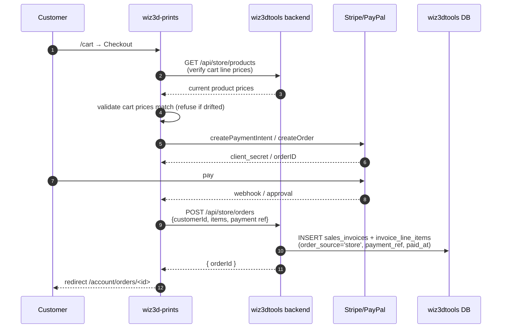
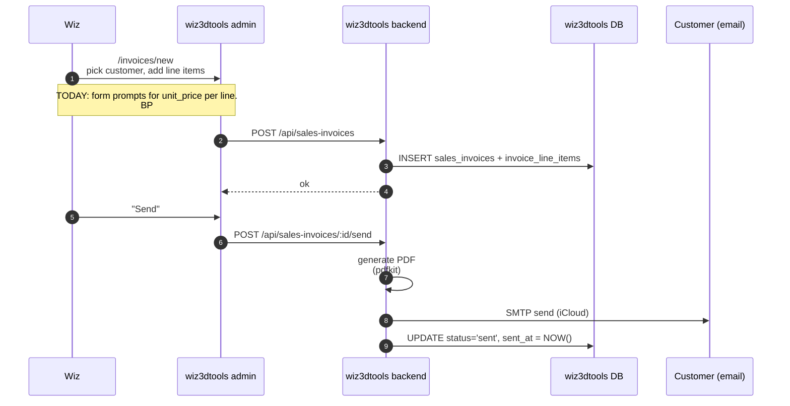
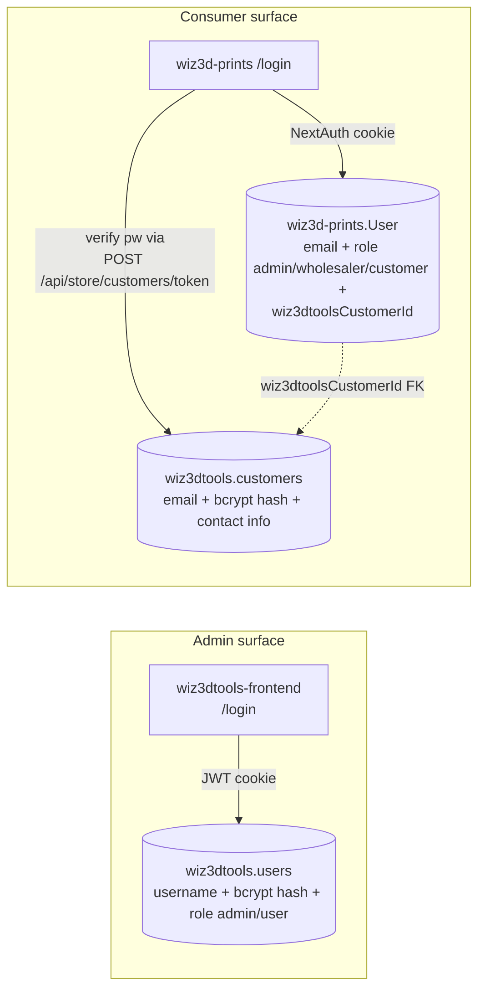

# Architecture — wiz3dtools and friends

**Audience**: Wiz, and any future Claude session that needs to reason about
where data lives before changing it.
**Last updated**: 2026-06-14 (initial — kicked off during BP #19 scoping).

## What this doc answers

> "I want to edit X — where does it live? Who else reads it?"

For every domain entity (product, customer, color, invoice, order,
filament inventory), this doc names the **canonical owner**, the
**mirror/reader systems**, and the **sync mechanism** that keeps them in
agreement.

If something here disagrees with the code, **trust the code and fix the
doc** — bring it up in chat.

---

## The three systems involved in the storefront ecosystem

Three services, three databases, two real integrations:

- **wiz3d-prints → wiz3dtools**: read-mostly storefront calls to
  `/api/store/*` (API key + optional per-customer signed token). The
  storefront has its own DB only for showcase content (portfolio,
  testimonials, services, materials, about) + consumer auth users.
- **wiz3dtools → BamBuddy**: one-way pull. Nightly 03:00 cron + manual
  "⟳ Sync from BamBuddy" button. wiz3dtools learns about filament + spool
  inventory; BamBuddy learns nothing about wiz3dtools.

Snailslap / Pawdio / other homelab apps are unrelated — out of scope here.

---

## Source-of-truth ownership

| Domain entity         | Canonical owner | Mirrored to / read by         | How it flows                                        |
|-----------------------|-----------------|--------------------------------|-----------------------------------------------------|
| Products              | wiz3dtools      | wiz3d-prints (read-only)       | `GET /api/store/products` per request, 60s cache    |
| Categories            | wiz3dtools      | wiz3d-prints (read-only)       | bundled into product payload                        |
| Product images        | wiz3dtools      | wiz3d-prints (URL refs only)   | URLs served from wiz3d-prints' R2 bucket; metadata on wiz3dtools |
| Product colors (recipe slots) | wiz3dtools | wiz3d-prints (read-only) | bundled into product payload                        |
| Customers (people/businesses) | wiz3dtools | wiz3d-prints (via `User.wiz3dtoolsCustomerId` FK) | wiz3d-prints signup calls `POST /api/store/customers` |
| Customer auth password hash | wiz3dtools (`customers.password_hash`) | wiz3d-prints verifies via store-api | bcrypt hash written on signup; consumer login on wiz3d-prints checks via store-API |
| Consumer accounts + roles (admin / wholesaler / customer) | **wiz3d-prints** (`User.role`) | wiz3dtools doesn't see this today | one-way: wholesale promotion lives on wiz3d-prints |
| Admin auth (wiz3dtools-frontend login) | wiz3dtools (`users`) | — | local cookie session, not shared |
| Sales invoices        | wiz3dtools      | —                              | admin-only; PDFs emailed to customer                |
| Invoice line items    | wiz3dtools      | —                              | snapshot per sale (own `unit_price`)                |
| Storefront orders     | wiz3dtools (`sales_invoices` with `order_source`) | wiz3d-prints (places via `POST /api/store/orders`) | wiz3d-prints checkout creates the row; admin sees it the same as a manual invoice |
| Colors (filament catalog) | **BamBuddy** | wiz3dtools (synced) → wiz3d-prints (read-only) | one-way nightly + manual button                     |
| Color curation (active flag, sort_order, multi-color, additional_hexes) | wiz3dtools | wiz3d-prints (read-only) | wiz3dtools-local; sync never overwrites              |
| Per-color inventory grams | **BamBuddy** (computed from spools) | wiz3dtools (synced) | one-way; sync rewrites `inventory_grams`             |
| Manufacturers (Bambu Lab, etc., spool weights, low/critical thresholds) | wiz3dtools | — | local table; not synced anywhere                    |
| Showcase content (portfolio, services, materials, testimonials, about blocks) | **wiz3d-prints** | wiz3dtools admin proxies edits via `/admin/showcase/*` | wiz3d-prints owns the schema + CRUD; wiz3dtools is just a polished admin UI |
| Print queue + printer status + MQTT events | **BamBuddy** | — | wiz3dtools no longer touches the queue (removed BP #6 Phase 3) |

**Quick test**: if the table above doesn't say "canonical owner" for the
field you're editing, **stop**. Either you're touching a mirror (changes
will be overwritten on next sync) or you're missing context.

---

## "Where do I edit X?" — daily-question version

| If you want to edit…                            | Go here                                |
|-------------------------------------------------|----------------------------------------|
| A product's name / description / price          | wiz3dtools admin → `/products/:id`     |
| Whether a product appears on the store / wholesale | wiz3dtools admin → `/products` row toggles |
| A product's images                              | wiz3dtools admin → `/products/:id` Images tab |
| A product's color recipe                        | wiz3dtools admin → `/products/:id` Colors section |
| A color's name / hex / manufacturer / multi-color flag | wiz3dtools admin → `/admin/colors` |
| A color's active flag (show on store)           | wiz3dtools admin → `/admin/colors` Status pill |
| A color's display order on the store picker     | wiz3dtools admin → `/admin/colors` (sort_order is wiz3dtools-owned; sync never touches it) |
| A color's inventory grams                       | **BamBuddy** (adjust the spool there); wiz3dtools just shows what the next sync pulls. The "+ Spool" admin button on wiz3dtools is a manual override for one-off corrections. |
| A customer's contact info                       | wiz3dtools admin → `/customers/:id`    |
| Whether a customer can log in to the store      | wiz3dtools admin → `/customers/:id` (sets password_hash via "Send invite") OR wiz3d-prints `/signup` form |
| A customer's wholesale-vs-retail role           | **wiz3d-prints** admin pages (User.role). NOT visible from wiz3dtools today — this is a known gap (see Open Architecture Questions below). |
| Storefront showcase content (portfolio, services, etc.) | wiz3dtools admin → `/admin/showcase/*` (proxies to wiz3d-prints' schema) |
| Manufacturer spool weights / thresholds         | wiz3dtools admin → `/admin/manufacturers` |
| The print queue / live print state              | **BamBuddy** (https://bambuddy.deckerzoo.com) |

---

## Data flows — the four common journeys

### Customer signs up on wiz3d-prints

**Why both sides write a row**: wiz3dtools owns the canonical customer
identity (everything an invoice needs); wiz3d-prints owns the auth +
role layer (everything the storefront needs to recognize a returning
customer + show the right catalog).

### Wiz publishes a new product

**There's no push** from wiz3dtools to wiz3d-prints — the storefront
pulls on every page load with a short cache. Publish flips a flag;
visibility happens on the next page render.

### A customer places an order on the storefront

**Idempotency**: `POST /api/store/orders` uses the payment provider
reference as an idempotency key — if wiz3d-prints retries on a flaky
network, wiz3dtools returns the existing order rather than duplicating.

### Wiz creates a manual invoice from the admin

**Storefront orders and manual invoices share the same `sales_invoices`
table**. `order_source` distinguishes them: `'store'` for wiz3d-prints
orders, `'manual'` for admin-created invoices. Wiz sees both in the
same `/invoices` list with a small badge.

---

## Identity model — admin vs consumer auth

There are TWO independent auth surfaces. Easy to confuse.

- **Admin** logs into `wiz3dtools-frontend` with a username/password
  stored in `wiz3dtools.users`. JWT cookie session. Used to manage
  products, customers, invoices, colors, etc.
- **Consumer** (a Wiz3D Prints customer) logs into `wiz3d-prints` with
  email/password. The login flow:
  1. wiz3d-prints' `[...nextauth].authorize()` calls
     `POST /api/store/customers/token` on wiz3dtools
  2. wiz3dtools' store API looks up `customers WHERE email = ?`,
     bcrypt-verifies, mints a short-lived signed token bound to the
     customer id (24h TTL — bumped from 30m on 2026-06-13)
  3. wiz3d-prints stores the token in the NextAuth session cookie + the
     `User.wiz3dtoolsCustomerId` link is set on first signup
  4. Subsequent storefront API calls send the token in
     `X-Customer-Token` so wiz3dtools knows which customer is acting
- **Roles** (admin / wholesaler / customer) live on wiz3d-prints'
  `User.role`. wiz3dtools doesn't see this today.

---

## The store API — every cross-system endpoint

All on wiz3dtools backend, all under `/api/store/*`. Two auth modes:

- **API-key only** (`STORE_API_KEY`): server-to-server reads + admin-ish
  writes (creating a customer during signup).
- **API-key + per-customer token** (`X-Customer-Token`): customer-scoped
  reads/writes (their orders, their account).

| Endpoint                              | Method | Auth                  | What it does                                        |
|---------------------------------------|--------|-----------------------|-----------------------------------------------------|
| `/api/store/products`                 | GET    | API-key               | Product catalog with colors + images + categories   |
| `/api/store/colors`                   | GET    | API-key               | Active color list for the customer color picker     |
| `/api/store/customers`                | POST   | API-key               | Create a customer during wiz3d-prints signup        |
| `/api/store/customers/:id`            | GET    | API-key + token       | Customer profile (account page)                     |
| `/api/store/customers/:id`            | PATCH  | API-key + token       | Update profile (contact info, password change)      |
| `/api/store/customers/token`          | POST   | API-key               | Verify email+password, mint a 24h customer token    |
| `/api/store/orders`                   | POST   | API-key + token       | Place an order (creates sales_invoice + line items) |
| `/api/store/orders?customerId=...`    | GET    | API-key + token       | Customer's order history                            |
| `/api/store/orders/:id`               | GET    | API-key + token       | Single order detail                                 |
| `/api/store/orders/:id/mark-paid`     | POST   | API-key               | Stripe/PayPal webhook lands here after capture      |

This is the **entire** wiz3dtools ↔ wiz3d-prints integration surface.
Any new feature that needs cross-system data either adds to this list
or routes through one of these endpoints.

---

## Open architecture questions (active or recently decided)

The following are tracked as BuildPlans so the doc stays small and the
work is visible on the dashboard.

| BP   | Status   | Question                                                                                                       |
|------|----------|----------------------------------------------------------------------------------------------------------------|
| #17  | PLANNING | Should the wiz3d-prints PDP recolor product photos dynamically (alpha-mask compositing)?                       |
| #18  | DONE     | `/admin/colors` + `/filament` were two pages editing the same `colors` table — collapsed into one.             |
| #19  | PLANNING | Drop `storeTitle`, `storeDescription`, `unitPrice` from `products` (Wiz picked Option A). Adds is_wholesale to customers (this doc nudged the design). |

**Standing gap** (not a BP yet): wholesale role lives on `wiz3d-prints.User.role`,
not on `wiz3dtools.customers`. Result: wiz3dtools' InvoiceForm can't auto-pick
wholesale-vs-retail unit price from the customer record alone. BP #19 will
either add a mirrored `is_wholesale` column on `wiz3dtools.customers`
(write path: wiz3d-prints sets it on role promotion) OR keep a manual
"Pricing tier" selector on the invoice header.

**Standing gap**: BamBuddy ↔ wiz3dtools color drift is mitigated by
the v1.13.0/v1.14.0 dedupe (Bug #66) but not architecturally solved.
Original framing of BP #18 was "consolidate to one source"; Wiz
explicitly chose NOT to touch BamBuddy or build a Spoolman bridge, so
the dual-system model stays — fenced by the dedupe tool and the
"new BamBuddy colors arrive inactive" gate. See
`docs/DECISION_filament_colors_sot.md` for the full rationale.

---

## Things that USED to be true but aren't anymore

Recording these because they show up in old comments + memory:

- **wiz3dtools owned the print queue** (`/queue`, `queue_items`,
  `printers`, `filament_jobs`). Removed in BuildPlan #6 Phase 3
  (2026-06-04). BamBuddy now owns all printer-side state.
- **wiz3dtools had a `/filament` page separate from `/admin/colors`**.
  Merged into `/admin/colors` in BP #18 (2026-06-14).
- **There were 7 hardcoded `MessageBucket` enum values in snailslap**.
  Unrelated — included to discourage the mistake of looking for "filter
  folders" here. Different project.
- **`unit_price` was a required field on `products`** (alongside
  wholesale + retail). BP #19 collapses to just wholesale + retail.
  Until that ships, `unit_price` is still required.

---

## Where to put new architecture decisions

- **System-level structural decisions** (something new owns something
  big) → update this doc + file a BuildPlan.
- **Single-feature changes** (a new column, a new endpoint) → file a
  Change in claude-peek; no doc update needed unless ownership shifts.
- **Schema migration that crosses system boundaries** → BuildPlan with
  a docs-update phase at the end.
- **Refactor that doesn't change ownership** → no doc update needed.

The first rule: if you find yourself unsure whether to file something
here vs in a project's CLAUDE.md, ask "would future-me wonder where
this lives across systems?" If yes, here. If it's only relevant within
one project, the project's CLAUDE.md is enough.
